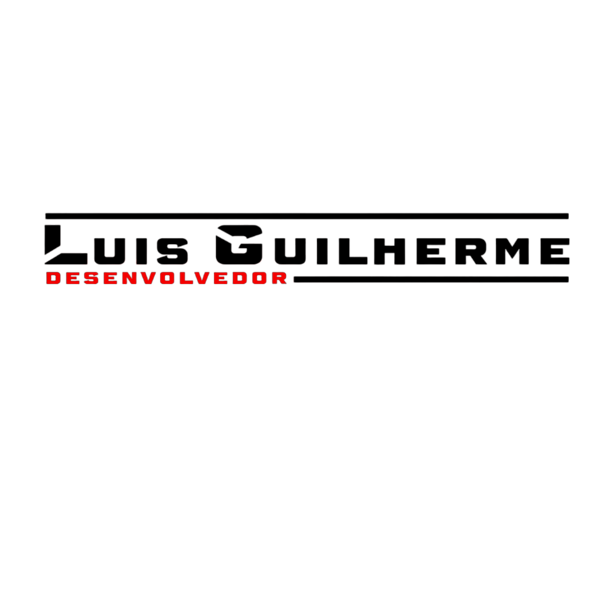
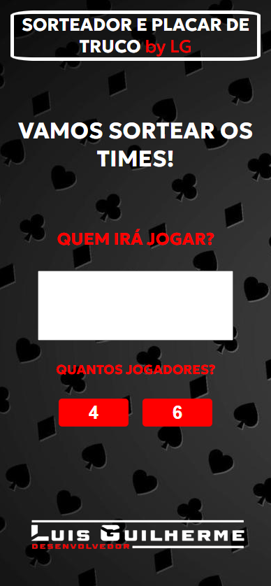
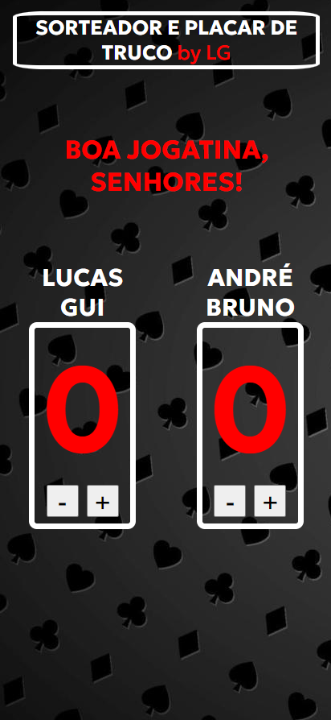
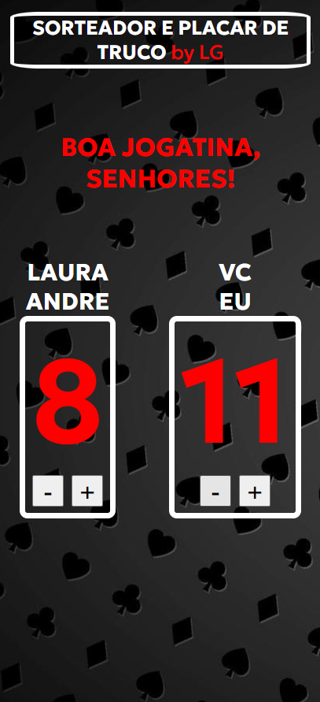
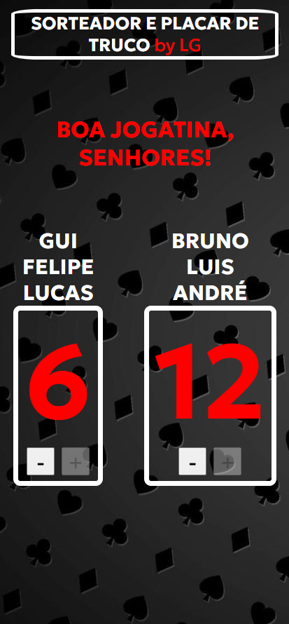

# Marcador&Sorteador de Truco ♣️ ♥️ ♠️ ♦️

Um app feito para melhorar sua experiência na jogatina com os amigos 😁

## Índice

- <a href="#tecnologia-utilizadas">Tecnologia Utilizadas</a>
- <a href="#funcionalidades">Funcionalidades do Projeto</a>
- <a href="#layout">Layout</a>
- <a href="#demostração">Demostração</a>
- <a href="#próximos-passos">Próximos Passos</a>
- <a href="#pessoa-autora">Pessoa Autora</a>

## [Tecnologia Utilizadas](#tecnologia-utilizadas)

- HTML: Utilizado para estruturar a base do projeto, organizando e exibindo nos navegadores.
- CSS: Utilizado para estilizar o projeto com imagens, fontes e cores.
- JavaScript: Utilizando para fazer a inclusão de dados na página, manipular a estrutura e para interação do usuário com o app.

## [Funcionalidades](#funcionalidades)

- [✅] Sorteio de Duplas
- [✅] Sorteio de Trios
- [✅] Contador de Pontos
- [✅] Responsivo (Prioridade para Mobile)

## [Layout](#layout)

- Tela inicial (Inserir nome dos jogadores / Escolher Duplas ou Trios)

- Placar Duplas

- Placar Duplas

- Placar Alterado

- Placar Final (12 pontos)

## [Demostração](#demostração)

- [Sorteador&Marcador de Truco](http://google.com)

## [Próximos Passos](#proximos-passos)

- Melhorar Layout no CSS
- Deixar o código mais limpo.

## [Pessoa Autora](#pessoa-autora)

- Luis Guilherme da Cruz
- 28 Anos, São Paulo - SP
- Estudante de Análise e Desenvolvimento de Sistemas - FAM
- [Linkedin](https://www.linkedin.com/in/luisguilhermedacruz/)

